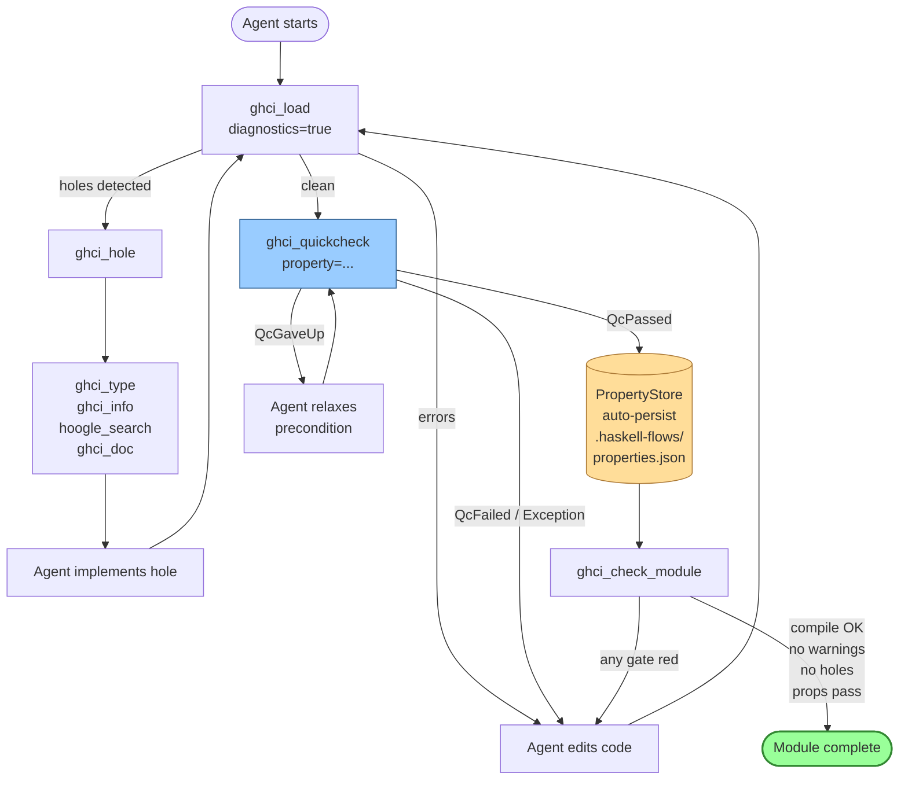
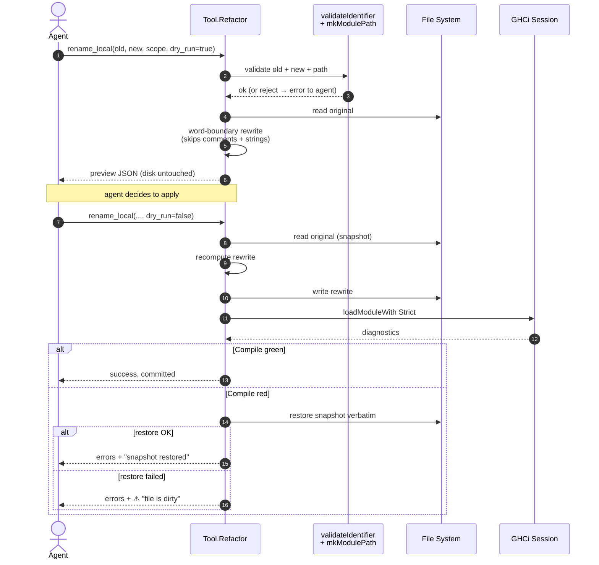
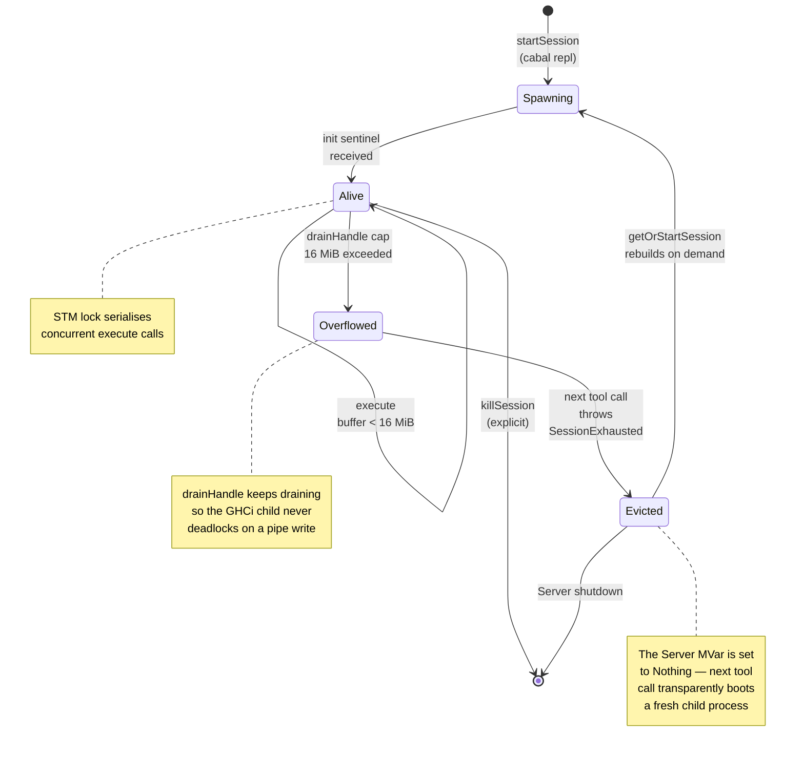

# MCP Flow Diagrams

Visual map of the four most important flows across the 20 tools shipped
in Phases 1-8. GitHub renders the Mermaid blocks inline — no tooling
needed to read this file.

Conventions used across every diagram:

| Shape       | Meaning                                  |
|-------------|------------------------------------------|
| `([text])`  | Terminal state (start / end)             |
| `[text]`    | MCP tool invocation                      |
| `((text))`  | Sub-loop referenced by name              |
| `[/text/]`  | Filesystem side effect                   |
| `[(text)]`  | Persistent store (JSON on disk)          |

---

## 1. Property-first dev loop

The central workflow. Every tool in the dev triangle (load / hole /
quickcheck) converges here; the terminal state is a module whose gates
are all green.

---

## 2. Bootstrap a new project end-to-end

Zero-to-shippable with an empty directory as the input. No hand-edits
to `.cabal`, no manual scaffolding.

```mermaid
flowchart LR
    empty([Empty directory]) --> create[ghci_create_project<br/>name=mypkg]
    create --> files[/.cabal<br/>cabal.project<br/>src/Mypkg.hs<br/>test/Spec.hs/]

    files --> deps[ghci_deps<br/>action=add<br/>package=text]
    deps --> restart[ghci_session<br/>action=restart]
    restart --> first[ghci_load<br/>src/Mypkg.hs]

    first --> types[Agent defines<br/>data types]
    types --> arb[ghci_arbitrary<br/>type_name=...]
    arb --> paste[Agent pastes<br/>Arbitrary instance]
    paste --> devloop((property-first<br/>dev loop))

    devloop --> allgreen[ghci_regression<br/>action=run]
    allgreen --> coverage[ghci_coverage]
    coverage --> ship([Shippable])

    style create fill:#fcf,stroke:#939
    style devloop fill:#9cf,stroke:#369
    style ship fill:#9f9,stroke:#383,stroke-width:2px
```

---

## 3. Refactor with snapshot-and-compile (the safety model)

This is the Phase 8 invariant: the compiler is the correctness oracle.
Textual rewrites are legal only if GHCi still type-checks the result;
otherwise the snapshot is restored verbatim.

---

## 4. GHCi session lifecycle (DoS + recovery model)

The Phase-5 security invariant. An agent asking for
`print [1..]` via `ghci_eval` will cause the child process to pipe
unbounded output — the buffer cap + overflow state + MVar eviction
turn that from a memory exhaustion vector into a self-healing recovery.

---

## Tool coverage

| Tool                   | Appears in |
|------------------------|------------|
| `ghci_load`            | 1, 2       |
| `ghci_hole`            | 1          |
| `ghci_type`            | 1          |
| `ghci_info`            | 1          |
| `hoogle_search`        | 1          |
| `ghci_doc`             | 1          |
| `ghci_quickcheck`      | 1          |
| `ghci_check_module`    | 1          |
| `ghci_create_project`  | 2          |
| `ghci_deps`            | 2          |
| `ghci_session`         | 2, 4       |
| `ghci_arbitrary`       | 2          |
| `ghci_regression`      | 2          |
| `ghci_coverage`        | 2          |
| `ghci_refactor`        | 3          |

Not shown because they're auxiliary / meta tools that don't anchor a
distinct flow: `ghci_eval`, `ghci_complete`, `ghci_goto`, `ghci_format`,
`ghci_workflow`.
